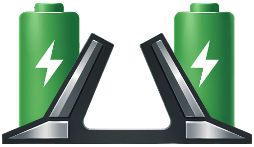

# HI-Drawbridge



~~Hi Drawbridge, I'm Dad!~~  
`hi-drawbridge` is a Linux `hidraw` to KDE's BatteryWatch D-Bus companion bridge.

It probes battery data from HID devices like mice and keyboards via raw HID reports and exports the result on the session bus using the [BatteryWatch](https://store.kde.org/p/2331781/) companion [contract](https://github.com/itayavra/batterywatch/blob/f35d3f34ae865e4412c0a0300f994c43e2cb8552/contents/ui/providers/CompanionProvider.qml). KDE and BatteryWatch are the main target. If you have a use case for other desktops or platforms, open an issue and we can talk about it.

The whole thing is profile-driven. In the happy path, adding support for a new device means adding a YAML profile, not writing a new pile of Go.

> [!WARNING]
> This project is a vibecoded personal experiment, and Go is not my primary language. It works, it is tested, and it does the job. If you spot something cursed, confusing, or just plain wrong, feedback and PRs are welcome.

## BUT... WHY?!

My Keychron M7 mouse has a rechargeable battery, but Linux has no idea how to read it properly, and what Keychron ships is basically a web app that only works in Chrome-ish browsers. It reads battery data from raw HID, which means the data is there, just locked behind a weird vendor UX choice.

I wanted a native Linux solution that could plug into my KDE desktop and BatteryWatch so all device batteries show up in one place instead of being scattered across.

And sure, this could have been a one-off script. But the reverse engineering cost is roughly the same whether I write a throwaway hack or something other people can extend. That is why the profiles are YAML-driven.

## What This Is

- A Linux-only CLI and background bridge for raw HID battery probing.
- A profile catalog for devices that expose battery data through vendor HID reports.
- A BatteryWatch companion provider over session D-Bus.
- A way to share device support without copy-pasting random shell scripts forever.

## What This Is Not

- Not a generic battery framework for every wireless device on Earth.
- Not a UPower integration.
- Not a GUI.
- Not an installer that modifies your machine for you.

`hi-drawbridge` does **not** install `udev` rules or systemd units automatically. That is deliberate.

## Requirements

- Linux
- Access to `/dev/hidraw*`
- Session D-Bus if you want to run `serve`
- Go `1.26.2` if you are building from source

No root is required for normal runtime use, but you may need a `udev` rule so your desktop user can actually access the relevant `hidraw` node.

## Build

```bash
go build -o bin/hi-drawbridge ./cmd/hi-drawbridge
```

## Homebrew

There is also a separate Homebrew tap for Linux Homebrew users.

```bash
brew tap devopyos/hi-drawbridge
brew install hi-drawbridge
```

Update it with:

```bash
brew update
brew upgrade hi-drawbridge
```

The Homebrew formula installs the binary and example setup assets. It does not install host integration for you, so if you want the user service or `udev` rules, follow [`docs/manual-setup.md`](docs/manual-setup.md).

## Quick Start

Probe once and print JSON:

```bash
./bin/hi-drawbridge probe
```

Probe one profile with more diagnostics:

```bash
./bin/hi-drawbridge --profile keychron_m7 probe-debug
```

Run the bridge service and export BatteryWatch companion data over D-Bus:

```bash
./bin/hi-drawbridge serve
```

Run without D-Bus, just poll and log locally:

```bash
./bin/hi-drawbridge serve --dry-run
```

Print the resolved runtime config:

```bash
./bin/hi-drawbridge config
```

If you just run the binary with no subcommand, it shows help:

```bash
./bin/hi-drawbridge
```

## Verify D-Bus Output

If `serve` is running, you can call the companion method directly:

```bash
gdbus call --session \
  --dest org.batterywatch.Companion \
  --object-path /org/batterywatch/Companion \
  --method org.batterywatch.Companion.GetDevices
```

The method returns a JSON string with device objects that BatteryWatch can consume.

## Configuration

Settings are resolved in this order, from lowest to highest precedence:

1. Built-in defaults
2. YAML config file at `~/.config/hi-drawbridge/config.yaml`
3. Environment variables with the `HI_DRAWBRIDGE_` prefix
4. CLI flags like `--config`, `--profile`, `--force-hidraw`, and `--log-level`

Minimal config example:

```yaml
bridge:
  preferred_transports: usb_direct,receiver
  retry_count: 6
  retry_delay_ms: 30
  cache_ttl_sec: 30
  stale_ttl_sec: 600
  service_poll_interval_sec: 10
  log_level: INFO
```

Useful examples:

```bash
HI_DRAWBRIDGE_log_level=DEBUG ./bin/hi-drawbridge probe-debug
HI_DRAWBRIDGE_force_hidraw=/dev/hidraw0 ./bin/hi-drawbridge probe
HI_DRAWBRIDGE_preferred_transports=usb_direct,receiver ./bin/hi-drawbridge config
```

The config file is for bridge/runtime settings only.

Profiles are resolved separately, in this order:

1. built-in embedded profiles from `internal/profile/profiles/`
2. local overlay YAMLs from `~/.config/hi-drawbridge/profiles`
3. `HI_DRAWBRIDGE_profiles_dir`
4. `--profiles-dir`

Local profile YAMLs can either add new profile IDs or override built-in ones.

Useful local-profile examples:

```bash
./bin/hi-drawbridge --profiles-dir ~/scratch/hi-drawbridge-profiles --profile my-device probe-debug
HI_DRAWBRIDGE_profiles_dir=/tmp/hi-drawbridge-profiles ./bin/hi-drawbridge --profile my-device probe
```

## Manual Setup

This thing will not touch your host integration for you.

If you want:

- a systemd user service
- `udev` rules for `hidraw` permissions

then do that part manually.

The checked-in examples and instructions live here:

- [`docs/manual-setup.md`](docs/manual-setup.md)
- [`packaging/systemd-user/`](packaging/systemd-user)
- [`packaging/udev-rules/`](packaging/udev-rules)

## Profiles

Shipped device support lives in:

- [`internal/profile/profiles/`](internal/profile/profiles)

If you just want to experiment locally without opening a PR, put YAML files in:

- `~/.config/hi-drawbridge/profiles`

Those local YAMLs are loaded on top of the built-in catalog. That means they can:

- add new profile IDs
- override built-in profile IDs while you are iterating

If you want to add support for a new device and have it ship as a built-in profile, the main path is:

1. reverse engineer the HID battery protocol
2. add a YAML profile
3. validate with `probe-debug`
4. add/update a matching example `udev` rule if the device needs one

There is a full guide for that here:

- [`docs/profile-authoring.md`](docs/profile-authoring.md)

## Project Status

Yes, this is a vibecoded experiment.

Yes, I hope it is not just random spaghetti glued together with vibes.

## Local Validation

If you are changing code, profiles, or docs that affect behavior, this is the baseline:

```bash
golangci-lint fmt --diff
golangci-lint run ./...
go test ./...
go test -race ./...
go vet ./...
go test -cover ./...
```

## Contributing

If you want to help, great.

If you change profiles, keep the rest of the repo in sync too:

- profile YAML
- docs
- example `udev` rules
- tests if behavior changed

Contributor workflow and expectations live in:

- [`CONTRIBUTING.md`](CONTRIBUTING.md)

## Troubleshooting

If the tool finds nothing:

- check that the device actually exposes a `hidraw` node
- check permissions on `/dev/hidraw*`
- try `probe-debug`
- try `--force-hidraw=/dev/hidrawN` if you already know the right node

If a device suddenly returns obviously wrong battery data or stops answering feature reads:

- run `probe-debug` once and save the output
- reconnect or replug the device/receiver
- run `probe-debug` again and compare `frame_source` and `last_frame_hex`

Some receivers get into a bad HID state and only produce low-information fallback frames. That is a hardware/driver-state problem, not necessarily a bad profile.

If `serve` works weirdly:

- make sure session D-Bus is available
- inspect `systemctl --user status hi-drawbridge.service`
- call the D-Bus method directly with `gdbus`

If your device is unsupported:

- that is normal
- use [`docs/profile-authoring.md`](docs/profile-authoring.md)
- or open an issue with descriptor info / probe-debug output / transport IDs
